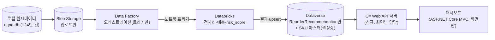

> 관련 문서: [[21. Appservice Core model]] 4·6·8-2절 · [[22. Cost Plan]] · [[28. Dataverse 가이드]] · [[작업지시서 (최민 — 데이터·인프라)]] · [[40.PIPELINE/README|40.PIPELINE README]] 2026-09-11 전달사항
> **상태**: 🟡 초안(Draft) — 오늘(2026-09-13) 팀 미팅에서 논의 후 확정 예정. 이 문서에서 "🤖 AI 추천"이라고 표시된 항목은 아직 팀 결정이 아니라 검토용 제안입니다. 표시 없는 항목은 기존 문서에 이미 확정돼 있던 내용을 재확인한 것입니다.
> **작성 배경**: 최민님이 Dataverse에 14개 원시 테이블(+7개 예정)을 적재하신 것을 두고 나경-최민 간 아키텍처 이해가 어긋난 것이 확인됨. 이 문서는 그 원인을 문서 근거로 정리하고, 세 분(최민/임현제/박형준)에게 나갈 지시사항을 팀 논의 전에 미리 다듬어두기 위한 것.

## 0. 무슨 일이 있었나 (사실관계 정리)

1. 원래 확정된 아키텍처([[21. Appservice Core model]] 6절, [[22. Cost Plan]] "서빙/액션 레이어" 행)는 **"원시데이터 → Data Factory → Databricks → 예측결과만 Dataverse"** 구조입니다. Dataverse에는 `ReorderRecommendation` 테이블 하나(7필드, [[28. Dataverse 가이드]] 3-2절)만 있으면 됩니다.
2. 나경이 사전에 "Factory보다 Dataverse부터 쓰자"고 구두로 지시한 적이 있고, 최민님은 그 지시를 그대로 따라 14개 엔터티(category/product/sku/factory/channel/store/inventory/purchase_order/po_item/orders/order_item/customer/return_request/inventory_ledger)를 CSV로 뽑아 Dataverse에 올리는 작업을 진행함([[40.PIPELINE/README|40.PIPELINE README]] 2026-09-11 항목, `dataverse_import/` 폴더).
3. **"+7개 예정 테이블"의 정체를 문서에서 확인함**: [[21. Appservice Core model]] 8-2절에 정의된 star-schema 데이터마트(`stg_pos_orders`/`stg_erp_products`/`dim_product`/`dim_channel`/`dim_date`/`fact_sales_daily`/`fact_inventory_daily`, 정확히 7개)와 개수·성격이 일치합니다. **이 7개는 이미 8-2절에서 "2차 프로젝트 스코프 밖, Year 2/3 백로그"로 명시적으로 제외 결정된 항목**입니다 — 새로 막을 필요 없이, 기존 결정을 다시 알려드리면 되는 문제입니다.
4. 즉 최민님은 잘못한 게 없습니다. 지시가 문서와 어긋났던 것이고, 이 문서로 지시를 문서 기준에 맞게 정정합니다.

## 1. 기준 아키텍처 (변경 아님 — 재확인)

- **Blob = 원시데이터 정착지**, Dataverse가 아닙니다.
- **Data Factory = 스케줄/트리거 역할**만. 500MB~1GB 규모 데이터를 직접 옮기거나 변환하지 않습니다.
- **Databricks = 처리 핵심**. 소형 클러스터 + 15~30분 자동종료([[22. Cost Plan]]).
- **Dataverse = 결과 저장소**. 지금 스코프에서 존재해야 할 테이블은 최대 2개뿐입니다 — `ReorderRecommendation`(확정) + SKU 마스터(3절에서 결정).
- **C# Web API 서버(신규)** = MVC 프론트와 Dataverse 사이에 위치. Dataverse OData/MSAL 인증, 실시간 데이터 생성을 전담하고, 프론트는 이 API만 호출(2026-09-13 추가 — 3절 항목 1 참고).

## 2. 기존 작업물 처리 방안

| 항목 | 처리 방안 |
| --- | --- |
| `dataverse_import/` 14개 CSV | **버리지 않음.** Dataverse에 올리는 대신 Blob Storage 업로드용 원본으로 그대로 재사용 — 목적지만 바꾸면 됨. 이미 만든 나경-최민 작업(ERD 정규화, `nqnq.db` 재생성 8/9→8/20 컷오프)은 전부 유효 |
| Dataverse에 이미 생성된 14개 테이블 | 🤖 AI 추천: 삭제 권장(스키마 오염 방지, 무료 환경이라 비용 문제는 아니지만 나중에 `ReorderRecommendation`과 혼동 위험) — 최민님 의견 듣고 오늘 확정 |
| "+7개 예정" 데이터마트 테이블 | **진행 중단.** 8-2절에 이미 Year 2/3 백로그로 결정돼 있음. 최민님께 "새로 막는 게 아니라 이미 있던 결정을 다시 안내하는 것"이라고 명확히 전달 |

## 3. 블로킹 결정 — 오늘 확정해야 하는 것 (기술스택 고정)

> 아래 항목이 계속 안 정해져서 최민님이 임의로 방향을 잡아 진행하시게 된 것이 이번 혼선의 근본 원인입니다([[작업지시서 (최민 — 데이터·인프라)]] 1-2절이 2026-09-10부터 미답변 상태). 🤖 표시는 AI 추천안 — 최민님이 다른 이유가 있으면 오늘 그 이유를 듣고 뒤집어도 됩니다. 대신 **오늘 정하면 이후엔 이 문서를 고쳐야만 바뀝니다.**

| # | 결정 항목 | 🤖 AI 추천 | 근거 |
| --- | --- | --- | --- |
| 1 | 대시보드↔Dataverse 연동 방식 | **별도 C# Web API 서버**를 둔다 (2026-09-13 변경 — 최민님이 C# 백엔드 개발을 직접 해보고 싶다고 확인됨) | 원래 [[작업지시서 (최민 — 데이터·인프라)]] 1-2절에서 최민님 본인이 띄웠던 옵션. MVC 프론트는 이 API만 호출하고, API가 Dataverse OData/MSAL을 전담 — 최민님(또는 백엔드 담당)이 실제 C# 서버 프로젝트를 처음부터 만들어볼 수 있음. 단 엔드포인트 수를 4개 내외로 제한해 2.5주 PoC 일정 리스크를 관리한다 |
| 2 | SKU 마스터 위치 | Dataverse에 **별도 소형 테이블**로 복제(Lookup) | 대시보드가 스타일명·컬러·사이즈 표시에 필요([[26. 대시보드 기술명세 (프론트)]] 1-3절 조인 요구사항). 이게 곧 "대시보드가 Factory도 참조해야 하나"의 답 — **아니오, Dataverse 안의 두 번째 작은 테이블로 해결**, Factory/Blob 직접 조회 없음 |
| 3 | 실시간 데이터 생성 실행 위치 | **새 C# Web API 서버 안의 `BackgroundService`/`PeriodicTimer`** (2026-09-13, 항목 1 변경에 맞춰 위치도 이동 — 별도 서버가 생겼으니 MVC 앱이 아니라 데이터를 실제로 쓰는 API 서버 쪽에 둔다) | `generate_v4.py`의 가중치·공식 로직을 C#으로 그대로 포팅. API 서버가 Dataverse 쓰기 권한을 갖고 있으니 실시간 생성도 같은 곳에서 처리하는 게 자연스러움 |
| 4 | `risk_score` 공식 | [[23. Alert & Trigger Rules]] 고정 가중치 공식으로 통일 | 문서가 SSOT 원칙 — 현재 구현(랜덤 구간)이 문서와 다른 쪽을 맞춰야 함 |
| 5 | `resolved_at`/`rejection_reason` 필드 | 둘 다 **추가(Yes)** | 대시보드 집계·기능명세서에 이미 필요 항목으로 명시, 필드 추가는 비용 영향 없음 |
| 6 | risk_score 근거값 저장 | **저장 안 함**(그때그때 계산) | 스키마 최소화 — 상세 드로어에서 계산해도 충분 |

## 4. 비용 관점 답변 (최민님 질문 대응)

- 전체 구조는 사실상 무료입니다([[22. Cost Plan]] — M365 Dev 무료 테넌트, Databricks 소형+자동종료, ADF 저비용).
- **원시데이터 124만 건을 Dataverse 테이블 14개+7개로 통째로 올리는 쪽이 오히려 리스크**입니다: Power Platform 무료 개발자 테넌트는 24시간당 API 요청 한도가 있어서, 대량 upsert 시 쓰로틀링에 걸릴 수 있습니다. 지금 구조(Dataverse = 결과 몇백 row)는 이 리스크가 없습니다.
- 결론: "대시보드는 Dataverse만 본다" 방향이 비용·안정성 면에서 더 안전한 선택입니다. 대시보드가 Factory(Azure DB)를 직접 참조하는 방향은 인증 경로가 하나 더 늘고 리스크만 커지므로 비추천 — 필요한 표시용 필드는 3절 SKU 마스터로 해결.

## 5. 역할별 지시사항 초안

### 최민 (데이터·인프라)
1. Dataverse에 만든 14개 원시 테이블 → 삭제(2절 확정 시)
2. "+7개" 데이터마트 테이블 작업 중단(8-2절 백로그, 이번 스코프 아님)
3. `dataverse_import/`의 14개 CSV(또는 `nqnq.db` 자체)를 **Blob Storage**에 업로드
4. Data Factory: Blob을 소스로 Databricks 노트북 트리거만 구성(변환 로직 없음)
5. Dataverse에는 `ReorderRecommendation`(7필드+3절 확정분+`auto_decidable`/`auto_decided` 2필드, [[ML·RAG·프론트·백엔드 실행설계 (요구사항-설계-구현-테스트)]] 2-5절) + SKU 마스터 테이블만 생성
6. Security Role 2종(`Reorder Approver`/`Viewer`) 세팅
7. **신규**: C# Web API 서버 프로젝트(`FashionAI.Api`) 신규 생성 — 엔드포인트 4개 내외(발주추천 조회/승인·반려/예측대조 조회/SKU 조회), 실시간 데이터 생성 `BackgroundService`도 이 프로젝트 안에 구현. 상세 설계는 [[ML·RAG·프론트·백엔드 실행설계 (요구사항-설계-구현-테스트)]] 4절 참고
8. [[작업지시서 (최민 — 데이터·인프라)]] 1-2절은 이 문서 3-①(별도 API 서버)로 갈음 — 이견 있으면 오늘 얘기

### 임현제 (ML·Databricks)
1. 소형 클러스터 + 15~30분 자동종료 설정 필수
2. Blob 마운트 → 전처리·피처엔지니어링·수요예측·risk_score 산출(23번 공식 기준)
3. 노트북 마지막 단계에서 Dataverse Web API로 **`ReorderRecommendation`만** upsert (원시데이터는 올리지 않음, 최민님 신규 API 서버를 거치지 않고 Dataverse에 직접 씀 — ML 결과 적재는 별개 경로)

### 나경·박형준 (대시보드·프론트)
1. 대시보드는 **최민님의 C# Web API만 호출** — Dataverse/Factory/Blob 직접 접근 없음(인증·연동은 전부 API 서버 담당)
2. 실시간 생성 로직은 이제 프론트가 아니라 **API 서버 쪽 담당**(3-③) — 프론트는 화면 렌더링에만 집중

## 6. 오늘 미팅 안건

1. 0절 사실관계에 이견 없는지 확인
2. 3절 블로킹 결정 6개 확정(🤖 추천안 그대로 갈지, 최민님 다른 의견 있는지)
3. 2절 — Dataverse 기존 14개 테이블 삭제 여부 확정
4. **기술스택 고정 원칙**(7절) 합의
5. **신규 — 임현제님 제안**: 담당자 부재 시 자동 의사결정(SLA 타임아웃 + 저위험 건 자동승인) 스트레치 채택 여부, SLA 시간·임계값 확정 ([[ML·RAG·프론트·백엔드 실행설계 (요구사항-설계-구현-테스트)]] 2-5절) — 코어 루프(9/23) 이후 착수 조건 재확인
6. **신규**: 위험 알람 Teams 긴급(Urgent) 우선순위 적용 여부 + 긴급임계값 확정(같은 문서 2-6절) — 별도 모바일 앱 신규 개발은 비추천으로 결론, 대안으로 제시

## 7. 기술스택 고정 원칙 (제안)

- 이 문서가 최신 기준. 확정 후 구두 지시로 방향을 바꾸지 않는다.
- 담당 영역에서 이 문서와 다르게 진행할 이유가 생기면, 먼저 나경에게 문서 개정을 요청 → 팀 확인 후 착수한다.
- 방향 변경은 항상 이 문서(또는 후속 번호 문서)에 기록으로 남긴다.
